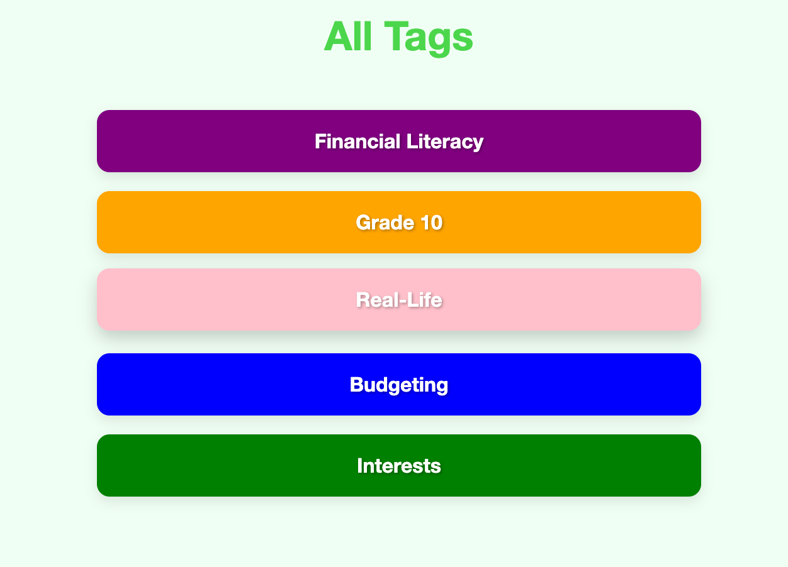

  

<h1 align="center">StudyLog</h1>

  <a href="https://study-log-1554b2b8599f.herokuapp.com/">CLICK TO TRY</a>

---

## Description

**StudyLog** is like your personal mistake notebook for math. You can save math problems you find difficult, organize them with tags, and add translations in different languages. It’s made for learners from all backgrounds, supporting multicultural and multilingual understanding.

By using translations and tags, you can learn math in a way that fits you best. Keep track of your challenges, learn from your mistakes, and improve your math skills — all in one place!

### Core Features:

- ✍️ Save and review difficult math problems
- 🔖 Organize problems with tags like algebra, geometry, etc.
- 🌐 Add multilingual translations (e.g., English, Chinese)
- 📅 Filter logs by date to track progress
- 💬 Made for diverse learners and multilingual classrooms

---

## Screenshot

| Description    | Screenshots                                      |
|---------------|--------------------------------------------------|
| Home Page     |  |
| Explore  |  |
| Log View      |  |
| Tag |  |

---

## Technologies Used

- Django
- Python
- HTML5 + CSS3
- NeonDB

---

## Getting Started

### Instructions

#### For Students / Users

1. Browse your saved study logs or create a new one.
2. Input the problem, solution steps, tags, and optional translation.
4. Edit or delete logs anytime.

